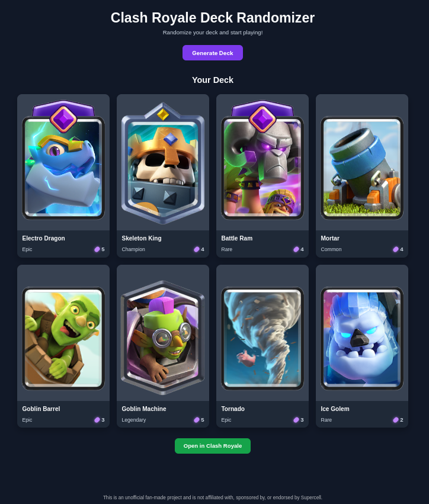

# Clash Royale Deck Randomizer

A small Flask application that generates random eight-card Clash Royale decks,
arranges Champions and Evolutions according to custom slot rules, and creates a
link for opening the resulting deck in Clash Royale.

## Live Demo

[Open Clash Royale Deck Randomizer](https://clash-royale-deck-randomizer.onrender.com/)

## Features

- Generates decks containing exactly eight unique cards.
- Limits each generated deck to at most two Champions.
- Activates Evolutions only in slots 1 and 3.
- Places Champions only in slots 2 and 3.
- Gives Champions priority over Evolutions in slot 3.
- Displays card artwork, rarity, and Elixir cost in a Flask web interface.
- Builds Clash Royale deck links from card IDs in their final slot order.
- Uses card information stored locally in `cards.json`.
- Includes deterministic pytest coverage and an additional randomized stress test.
- Runs the test suite automatically with GitHub Actions.

## Screenshot



## Deck rules

An Evolution-capable card has an active Evolution only when it is assigned to
slot 1 or slot 3. Slot 2 is never an active Evolution slot. A card that supports
Evolution can still appear as a normal card in any remaining slot.

Champions can occupy only slots 2 and 3, and a deck can contain no more than two
Champions. When both a Champion and an Evolution-capable card are available for
slot 3, the Champion takes priority.

| Slot | Priority |
| --- | --- |
| 1 | Evolution |
| 2 | Champion, otherwise a normal card |
| 3 | Champion, then Evolution, then a normal card |
| 4–8 | Remaining cards with no active Evolution |

With two Champions and two Evolution-capable cards, the resulting arrangement
can be:

```text
Slot 1 -> Evolution
Slot 2 -> Champion
Slot 3 -> Champion
Slot 4 -> Evolution-capable card used normally
Slot 5 -> Normal card
Slot 6 -> Normal card
Slot 7 -> Normal card
Slot 8 -> Normal card
```

## Requirements

- Python 3.10 or newer
- `pip`

Runtime dependencies are declared in `requirements.txt`. Development and test
dependencies are declared in `requirements-dev.txt`, which also installs the
runtime requirements. GitHub Actions currently tests the project on Python 3.14.

## Installation

Clone the repository and enter its directory:

```bash
git clone https://github.com/Franek2009/ClashRoyaleDeckRandomizer.git
cd ClashRoyaleDeckRandomizer
```

Create and activate a virtual environment:

```bash
python -m venv .venv
source .venv/bin/activate
```

Install the development dependencies:

```bash
pip install -r requirements-dev.txt
```

## Running

### Development

Start the application locally with Flask's development server:

```bash
python app.py
```

Open <http://127.0.0.1:5000> and select **Generate Deck**. The generated
**Open in Clash Royale** link contains the eight card IDs in the same order as
the displayed deck slots.

The development server is intended only for local use. Render is not required
to install or run the project locally.

### Production-like local run

Run the application locally with Gunicorn using the existing Flask application
object:

```bash
gunicorn app:app
```

The lightweight `GET /health` endpoint returns the application's health status
for hosting and monitoring checks without loading card data or generating a
deck.

### Command-line demo

For a simple command-line demonstration that prints a random deck, run:

```bash
python main.py
```

## Testing

Run the complete test suite with:

```bash
python -m pytest -q
```

The deterministic tests cover card classification, deck size and uniqueness,
Champion limits, the 0/1/2 Champion cases, Evolution and Champion slot rules,
slot priority, inactive Evolution-capable cards, and deck-link construction. A
separate stress test generates 1000 decks from the local card data.

GitHub Actions runs the same test command for every push and pull request to
`main`. The workflow is defined in `.github/workflows/ci.yml`.

## Project structure

```text
ClashRoyaleDeckRandomizer/
├── .github/workflows/ci.yml
├── docs/
│   └── screenshot.png
├── static/
│   └── style.css
├── templates/
│   └── index.html
├── tests/
│   ├── test_deck_link.py
│   └── test_randomizer.py
├── app.py
├── cards.json
├── deck_link.py
├── main.py
├── randomizer.py
├── pytest.ini
├── render.yaml
├── requirements-dev.txt
├── requirements.txt
├── LICENSE
└── README.md
```

## Architecture and data flow

The project deliberately keeps a small module-based structure:

```text
cards.json
    -> app.py loads local card data
    -> randomizer.py selects and arranges eight cards
    -> deck_link.py serializes final slot IDs into a Clash Royale link
    -> templates/index.html renders the deck and link
```

`randomizer.py` contains the independently tested deck rules. `app.py` handles
HTTP requests and template rendering, while `deck_link.py` only converts the
arranged slot sequence into the game link. No external API is called while a
deck is generated.

## Deployment

The application is publicly deployed as a Render Web Service at the URL in
[Live Demo](#live-demo). The Blueprint in `render.yaml` defines the service,
installs `requirements.txt`, starts the application with Gunicorn, and uses
`/health` for health checks.

GitHub Actions runs the pytest suite for pushes and pull requests to `main`.
Render is configured to start automatic deploys only after the linked GitHub
checks pass.

The service currently uses Render's Free plan. Free web services spin down
after periods without inbound traffic, so the first visit after inactivity can
take longer while the service starts again.

## Current limitations

- `cards.json` is a local snapshot and can become outdated as the game changes.
- Deck generation has no filters for arenas, card levels, or player collections.
- The random seed and generated decks are not persisted between requests.
- Card artwork is referenced through external URLs stored in `cards.json` and
  therefore requires network access in the browser.

## Project status

The core deck generation, slot arrangement, web interface, automated tests, and
GitHub Actions CI are working. Production serving, the Render deployment,
health monitoring, and project documentation are complete. Version 1.0.0 is the
first stable release of the project.

## Releases

Official project versions are published through GitHub Releases. This web
application does not provide separate downloadable application packages.

## License

The original source code created in this repository is available under the MIT
License. See [LICENSE](LICENSE).

The MIT License applies only to that original project code. The Clash Royale
name, Supercell trademarks, card artwork, game materials, and other Supercell
intellectual property are not licensed by this project and remain the property
of their respective owners. Nothing in this repository grants permission to
relicense or redistribute Supercell-owned materials beyond any rights provided
by their owners and applicable policies.

## Disclaimer

This is an unofficial, independent fan-made project. It is not affiliated with,
sponsored by, endorsed by, or otherwise approved by Supercell.

Clash Royale and related trademarks and materials belong to Supercell and their
respective owners. Use of fan content is subject to
[Supercell's Fan Content Policy](https://supercell.com/en/fan-content-policy/).
